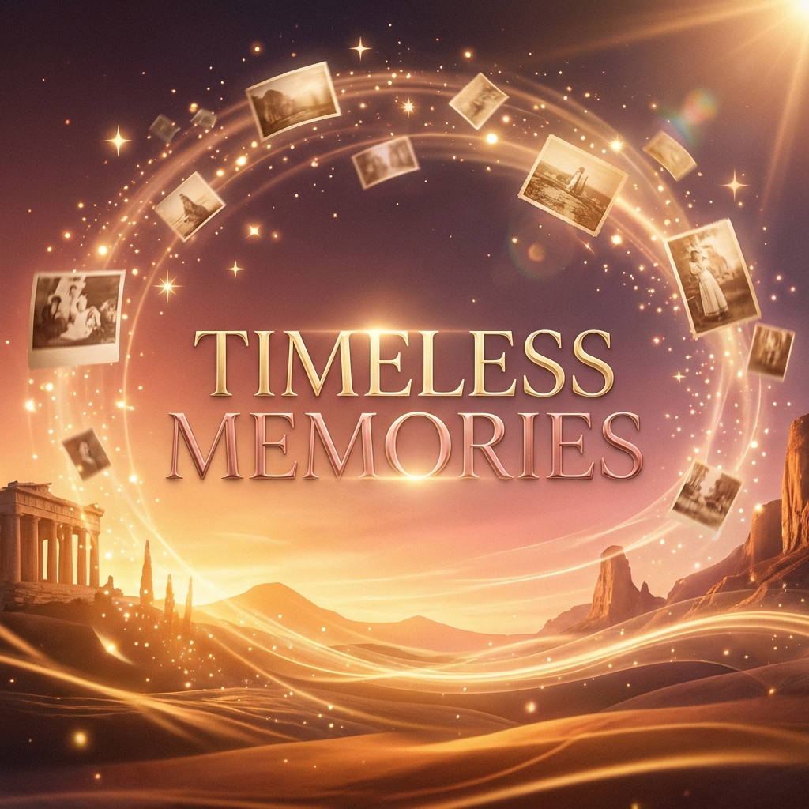
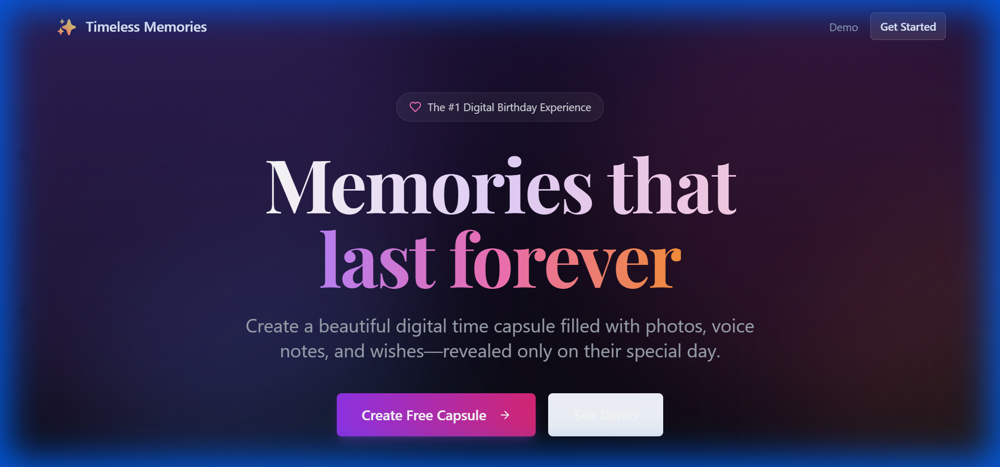
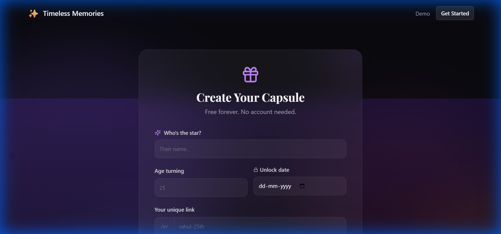

<div align="center">

  

  <h1 align="center">Timeless Memories</h1>

  

  <p align="center">
    <strong>The ultimate digital birthday time capsule experience.</strong>
    <br />
    Capture fleeting moments. Preserve the warmth. Reveal the magic.
    <br />
    <a href="https://timeless-memories-rouge.vercel.app/"><strong>Explore the Live Demo »</strong></a>
    <br />
    <br />
    <a href="#-features">Features</a>
    ·
    <a href="#-tech-stack">Tech Stack</a>
    ·
    <a href="#-getting-started">Getting Started</a>
    ·
    <a href="#-contact">Contact</a>
  </p>

  <p align="center">
    
    
    
    
  </p>
</div>

---

## 📖 About The Project

**Timeless Memories** is a premium, interactive digital experience designed to celebrate birthdays in a way that’s more than just a message. It’s a virtual sanctuary where friends and family can curate a collection of photos, voice notes, and heartfelt wishes, all safely locked away until the big day.

Inspired by premium design systems like **Cluely**, the landing page features a "Golden Hour" aesthetic with immersive animations, glassmorphism, and smooth scroll-triggered reveals that make the anticipation of a surprise truly magical.

### 🎥 Visual Preview

| Landing Page (Golden Hour) | Event Creation |
| :---: | :---: |
|  |  |


---

## ✨ Features

- **🧩 Memory Maze:** The birthday person doesn't just "get" their gift. They solve personal riddles and clues to unlock photos and memories shared by friends.
- **🎙️ Voice Note Capsules:** Hear the laughter and emotion. Contributors can record voice messages that trigger when their memory is unlocked.
- **⏳ Scheduled Reveals:** Leave messages that only appear at specific hours during the day, creating a timeline of surprises.
- **🔒 Countdown Lock:** A beautiful, animated lock screen with a live timer prevents any "early peeking."
- **🎨 Bento UI Design:** A modern, organized feature grid that looks and feels like a top-tier SaaS product.
- **⚡ Serverless Edge:** Deployed on Vercel with a lightning-fast backend using Supabase and Drizzle ORM.

---

## 🛠 Tech Stack

### Frontend
- **React 18** (Vite)
- **Framer Motion** (Ethereal animations & scroll reveals)
- **Tailwind CSS** (Modern glassmorphic styling)
- **Wouter** (Lightweight routing)
- **Lucide React** (Beautiful iconography)

### Backend
- **Express.js** (Serverless API)
- **Supabase** (PostgreSQL Database & Auth)
- **Drizzle ORM** (Type-safe database interactions)

### Deployment
- **Vercel** (Global edge hosting)

---

## 🚀 Getting Started

### Prerequisites
- Node.js (v18+)
- A Supabase account

### Installation

1. **Clone the repo**
   ```sh
   git clone https://github.com/iAMv1/PhotoPileMemory.git
   ```

2. **Install NPM packages**
   ```sh
   npm install
   ```

3. **Set up your environment variables**
   Create a `.env` file in the root:
   ```env
   DATABASE_URL=your_postgresql_url
   VITE_SUPABASE_URL=your_supabase_url
   VITE_SUPABASE_ANON_KEY=your_supabase_key
   ```

4. **Run the development server**
   ```sh
   npm run dev
   ```

---

## 🤝 Contributing

Contributions are what make the open-source community such an amazing place to learn, inspire, and create. Any contributions you make are **greatly appreciated**.

1. Fork the Project
2. Create your Feature Branch (`git checkout -b feature/AmazingFeature`)
3. Commit your Changes (`git commit -m 'Add some AmazingFeature'`)
4. Push to the Branch (`git push origin feature/AmazingFeature`)
5. Open a Pull Request

---

## 📜 License

Distributed under the MIT License. See `LICENSE` for more information.

---

## 📧 Contact

**Project Lead:** [@iAMv1](https://github.com/iAMv1)  
**Project Link:** [https://github.com/iAMv1/PhotoPileMemory](https://github.com/iAMv1/PhotoPileMemory)

<div align="center">
  <br />
  <p>Made with ❤️ to celebrate the people who matter most.</p>
</div>
